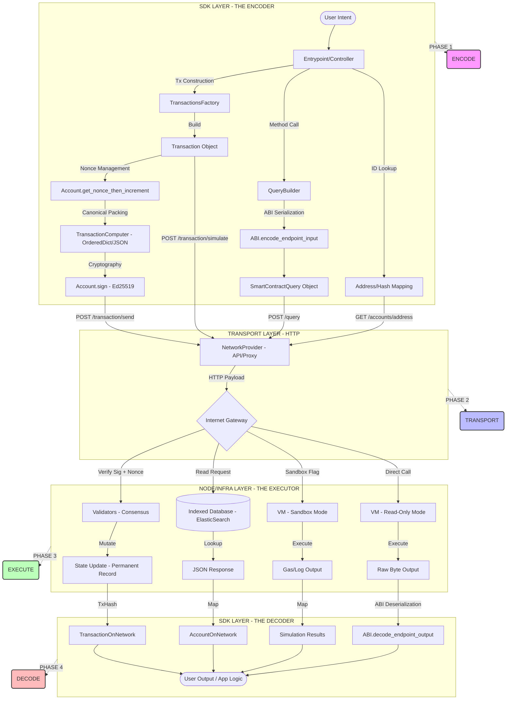

# PYTHON-SDK

**sdk-py has 5 primary execution flows**, each representing a different interaction model with the blockchain.

## 5 Execution Flows

1. Transaction Execution Flow        `(WRITE → state change)`
2. Query Execution Flow             `(READ → no state change)`
3. Simulation Flow                  `(DRY RUN → no commit)`
4. Account/State Retrieval Flow     `(READ → indexed data)`
5. Batch / Multi-Transaction Flow   `(WRITE → multiple tx)`

```mermaid
graph TD
    A["User Intent (Controller/Factory)"] -->|create_transaction| B["Transaction Object"]
    B --> C["Account.get_nonce_then_increment()"]
    C --> D["Account.sign_transaction()"]
    D -->|Internal Call| E["TransactionComputer (Canonical JSON)"]
    E -->|Deterministic Bytes| F["Account.sign(bytes) -> Ed25519 Signature"]
    F --> G["NetworkProvider.send_transaction()"]
    G -->|POST /transaction/send (Proxy) or /transactions (API)| H["Network (HTTP Proxy)"]
    H -.-> I["Node (Verification & State Change)"]

```

## 1. TRANSACTION EXECUTION FLOW (Core Flow)

**TRANSACTION EXECUTION FLOW**

1. **factory.create_transaction_for_transfer()** [`multiversx_sdk/transfers/transfer_transactions_factory.py:106`]
   ↓
2. **account.get_nonce_then_increment()** [`multiversx_sdk/accounts/account.py:67`]
3. **account.sign_transaction(transaction)** [`multiversx_sdk/accounts/account.py:57`]
   ├─ **TransactionComputer.compute_bytes_for_signing(transaction)**
   │  [`multiversx_sdk/core/transaction_computer.py:43`]
   │  [Prepare data for cryptographic hash]
   ├─ **_to_dictionary(transaction)**
   │  [`multiversx_sdk/core/transaction_computer.py:132`]
   │  [Field ordering via `OrderedDict`]
   └─ **_dict_to_json(dictionary)**
      [`multiversx_sdk/core/transaction_computer.py:173`]
      [CANONICAL JSON: `json.dumps(..., separators=(",", ":"))`]
   └─ **self.secret_key.sign(serialized_tx)** [`multiversx_sdk/wallet/user_keys.py`]
      [Produce Ed25519 signature bytes]
   ↓
4. **api.send_transaction(transaction)** [`multiversx_sdk/network_providers/api_network_provider.py:146`]
   ├─ **transaction.to_dictionary()**
   │  [`multiversx_sdk/core/transaction.py`]
   │  [Finalize payload with signature]
   └─ **do_post_generic("transactions", data)**
      [`multiversx_sdk/network_providers/api_network_provider.py:297`]
      [HTTP POST to Gateway/API]
   ↓
5. **Node Processing (Asynchronous)** [mx-chain-go Infrastructure]
   ├─ **Signature Verification** (Verify Ed25519)
   ├─ **Protocol Checks** (Nonce, Balance, Gas)
   └─ **State Execution** (VM Update)
   ↓
6. **Return Transaction Hash** [`multiversx_sdk/network_providers/api_network_provider.py:149`]
   [Transaction broadcasted successfully]

### Step 1: The Entrypoint — Choosing Your Branch

**Purpose:** Before doing anything, you must tell the SDK which "network" you are talking to. Is it the real network with real money (**Mainnet**) or the playground for testing (**Devnet**)?

**The Code:**
```python
from multiversx_sdk import DevnetEntrypoint
entrypoint = DevnetEntrypoint()
```

**Behind the Scenes:** Think of the Entrypoint as picking which bank branch you are visiting. It sets up the default connection addresses and prepares the toolkit you'll need for everything else. Without this, your computer doesn't even know where the blockchain "lives."

### Step 2: The Factory — Drafting the Order

**Purpose:** You need to fill out a "form" describing what you want to do. Instead of writing raw code, you use a **Factory** to create a transaction object.

**The Code:**
```python
factory = entrypoint.create_transfers_transactions_factory()
tx = factory.create_transaction_for_transfer(
    sender=alice_address,
    receiver=bob_address,
    native_amount=1000000000000000000  # 1 EGLD
)
```

**Behind the Scenes:** The Factory is like a smart assistant that knows the rules. It takes your simple intent ("Send 1 EGLD to Bob") and creates a **Transaction Object**. This object holds the sender, receiver, amount, and also calculates the "Gas Limit"—the small fee you pay to the network for processing your request.

### Step 3: The Account — The Sequential Stamp (Nonce)

**Purpose:** To prevent someone from "replaying" your transaction (e.g., sending the same 1 EGLD fifty times), every transaction must have a unique sequential number called a **Nonce**.

**The Code:**
```python
# Before creating the tx, get the latest number from your account
nonce = account.get_nonce_then_increment()
tx.nonce = nonce
```

**Behind the Scenes:** Your account keeps a counter. If your last transaction was number `5`, this one _must_ be number `6`. The `get_nonce_then_increment()` function fetches `5`, assigns it to your draft, and then updates your local counter to `6`. It's like a checkbook where the check numbers must follow a perfect 1, 2, 3 order.

### Step 4: The TransactionComputer — Packaging for the Mail

**Purpose:** Computers in different parts of the world need to read your "form" exactly the same way. You must convert your Python object into a specific, "canonical" text format (JSON).

**The Code:**
```python
from multiversx_sdk import TransactionComputer
computer = TransactionComputer()
serialized_tx = computer.compute_bytes_for_signing(tx)
```

**Behind the Scenes:** "Canonical" means there are no extra spaces, no tabs, and the fields are always in the same alphabetical order. The **TransactionComputer** takes your draft and shrinks it into a tight, standardized string. If even one space was different, your signature (in the next step) would fail!

### Step 5: Account Signing — The Digital Seal

**Purpose:** This is the most critical step. You use your "Secret Key" to prove that _you_ (and only you) authorized this request.

**The Code:**
```python
signature = account.sign_transaction(tx)
```

**Behind the Scenes:** The SDK takes the standardized string from Step 4 and runs it through a cryptographic algorithm (called **Ed25519**). This produces a long string of random-looking characters (the signature) that is attached to your transaction. It is mathematically impossible to forge this without your secret key.

### Step 6: The NetworkProvider — Mailing the Letter

**Purpose:** Now that your document is drafted, numbered, and signed, it's time to send it to the network's local "post office."

**The Code:**
```python
api = entrypoint.create_network_provider()
tx_hash = api.send_transaction(tx)
```

**Behind the Scenes:** The **NetworkProvider** performs an "HTTP POST"—it technically uploads your signed transaction to a server (a Proxy or API). In return, you get a **Transaction Hash**. This is your "tracking number" which allows you to watch the transaction move through the network.

### Step 7: The Node — The Vault and the Record

**Purpose:** This happens entirely on the blockchain nodes (the thousands of computers running the network). It is where the "magic" of decentralization happens.

**Behind the Scenes:**

1. **Verification:** A Node receives your transaction and checks your signature. If it matches your public address, it knows it's authentic.
2. **Routing:** The network identifies which "Shard" (the processing unit) Alice and Bob belong to.
3. **Execution:** The Virtual Machine (VM) runs the logic: "Does Alice have enough money? Yes. Subtract 1 EGLD from Alice, add 1 EGLD to Bob."
4. **State Change:** Once finished, the Node updates the global ledger. This is the **State Change**.

## 2. QUERY EXECUTION FLOW (Read-only)

### Query Flow Steps:

1. **controller.query()** [`multiversx_sdk/smart_contracts/smart_contract_controller.py:205`]
   - High-level helper that runs the entire sequence below.

2. **controller.create_query()** [`multiversx_sdk/smart_contracts/smart_contract_controller.py:231`]
   - **_encode_arguments()** [L249]
     - **abi.encode_endpoint_input_parameters()**
       - [Translate Python args to bytes]
   - **SmartContractQuery()** object initialized. [L241]

3. **controller.run_query(query)** [`multiversx_sdk/smart_contracts/smart_contract_controller.py:261`]
   - **network_provider.query_contract(query)** [`multiversx_sdk/network_providers/api_network_provider.py:280`]
     - [POST request sent to network]

4. **controller.parse_query_response(response)** [`multiversx_sdk/smart_contracts/smart_contract_controller.py:264`]
   - **abi.decode_endpoint_output_parameters()** [L268]
     - [Translate byte response to Python types]

The **Query Flow** is the "Read-Only" lane. It is the only way to get data from a Smart Contract without incurring costs or waiting for block confirmation. Because it has **no nonce and no signature**, it is physically impossible for this flow to ever change a balance or deploy a contract.

### How to Read the Blockchain Without Permission

If a **Transaction** is like a notarized contract that moves money, a **Query** is like a library card. You are just looking at information. You don't need to sign anything, you don't need to pay fees, and you don't have to wait for the network to "approve" your request.

Here is the "Fast Lane" flow for reading blockchain data.

### Step 1: The Controller — The Librarian

**Purpose:** Creating the "Reader" tool that understands your Smart Contract's specific rules (the ABI).

**The Code:**
```python
controller = SmartContractController(chain_id="D", network_provider=api, abi=my_abi)
```

**Behind the Scenes:** The Controller is your orchestrator. It holds the "Map" (the ABI file) that explains how the data in the contract is structured. It knows that a "Number" on the blockchain isn't just text—it's a specific sequence of bytes.

### Step 2: Preparing the Question (Encoding)

**Purpose:** Turning your human question (e.g., "What is Alice's balance?") into a format the Virtual Machine (VM) understands.

**The Code:**
```python
query = controller.create_query(
    contract=contract_address,
    function="getBalance",
    arguments=[alice_address]
)
```

**Behind the Scenes:** Internally, `create_query()` calls `_encode_arguments()`. It looks at your ABI and translates `alice_address` into the raw hexadecimal bytes the contract expects. This is exactly like Step 4 of the Transaction Flow, but we stop there—we don't sign it!

### Step 3: Bypassing the Hurdles (No Nonce, No Signature)

**Purpose:** This is the most important distinction. Because we aren't changing anything, we "skip" the security checks required for moving money.

**Behind the Scenes:** In the **Transaction Flow**, you have to wait for your `nonce` (sequence number) and provide an `Ed25519` signature. In the **Query Flow**, we skip these entirely. We don't need them because we aren't asking the blockchain to _do_ anything—we are just asking it to _show_ us something.

### Step 4: The Network Provider — The Courier

**Purpose:** Delivering your question to the network and waiting for the raw answer.

**The Code:**
```python
query_response = controller.run_query(query)
```

**Behind the Scenes:** The `run_query` function sends an HTTP POST request to the network (usually ending in `/query` or `/vm-values/query`). The network nodes receive your question, run the contract logic in an "instant-read" mode, and send back a response immediately.

### Step 5: Decoding the Answer — The Translator

**Purpose:** Turning the raw, garbled bytes back into a human-readable Python object.

**The Code:**
```python
result = controller.parse_query_response(query_response)
# returns: [500] (e.g., 500 EGLD)
```

**Behind the Scenes:** The node sends back a list of bytes. The **Controller** uses the ABI again (the reverse of Step 2) to translate those bytes back into a Python integer, string, or list.

## 3. SIMULATION FLOW (Dry Run)

1. **api.simulate_transaction(tx)** 
[`multiversx_sdk/network_providers/api_network_provider.py:151`]
	- Sets the target URL to include `?checkSignature=false`. 
↓ 
2. **api.do_post_generic("transaction/simulate", tx.to_dictionary())**
[`multiversx_sdk/network_providers/api_network_provider.py:297`]
	- Packages the transaction as JSON and sends the POST request. 
↓ 
3. **Node Sandbox Execution**
	- The VM runs the transaction logic but ignores any "write" commands to the database. 
↓ 
4. **transaction_from_simulate_response(response)** 
[`multiversx_sdk/network_providers/http_resources.py:231`]
	- Parses the node's report and returns a `TransactionOnNetwork` object full of data but with a "Simulated" status.
### How to Preview the Future without Paying the Price

Imagine you are building a complex LEGO set, but you only have one attempt to get it right, and every mistake costs you money. Wouldn't it be great if you could "ghost-build" the entire thing in a holographic simulator first? That is exactly what a **Simulation** (or "Dry Run") does for your blockchain transactions.

Here is the step-by-step assembly line for a transaction that never actually happens—but tells you everything that _would_ happen.

### Step 1: The Factory — Drafting the Real Deal

**Purpose:** You create a transaction draft that is identical to a real one. The blockchain node needs to think you are serious so it can give you an accurate result.

**The Code:**
```python
factory = entrypoint.create_transfers_transactions_factory()
tx = factory.create_transaction_for_transfer(
    sender=alice,
    receiver=contract,
    native_amount=0,
    data=b"my_function@01"
)
```
**Behind the Scenes:** The Factory builds a **Transaction Object**. Even though this is just a practice run, we fill it with real data: who is sending it, which contract we are talking to, and what "data" (instructions) we are giving it.

---

### Step 2: The Account — Setting the Timeline (Nonce)

**Purpose:** Even for a simulation, the blockchain needs to know which "version" of your account is talking.

**The Code:**
```python
tx.nonce = account.nonce # We use the current nonce
```
**Behind the Scenes:** A simulation usually tests what would happen _right now_. By using your current **Nonce** (the sequence number of your account), the node can check if your account has enough balance at this exact moment and if you are authorized to make the call.

### Step 3: The TransactionComputer — Final Formatting

**Purpose:** Turning the "form" into the professional "packet" that the network accepts.

**The Code:**
```python
from multiversx_sdk import TransactionComputer
computer = TransactionComputer()
# Simulation still needs the tx to be in the correct JSON format
serialized = computer.compute_bytes_for_signing(tx)
```
**Behind the Scenes:** The **TransactionComputer** ensures your draft is perfectly formatted. Even though we are just "simulating," the node expects the same "Canonical JSON" format as a real, live transaction.

### Step 4: The Network Provider — The "What If?" Request

**Purpose:** Instead of saying "Put this in the record book," you say "Tell me what would happen if I did this."

**The Code:**
```python
api = entrypoint.create_network_provider()
result = api.simulate_transaction(tx)
```
**Behind the Scenes:** This is the fork in the road. In a real flow, you would call `send_transaction`. In this flow, you call `simulate_transaction`. This sends the data to a special endpoint (`/transaction/simulate`) that adds an invisible flag saying: **"Dry Run Only."**

 Step 5: The Node — The Sandbox Execution

**Purpose:** The node runs your code in a isolated "sandbox" where it can't break anything or change any balances.

**Behind the Scenes:** The Node does three things:

1. **Skip the Signature:** By default, it sees you are just "simulating" and doesn't require you to sign with your private key (though you can if you want).
2. **Run the VM:** It powers up the Virtual Machine and executes your instructions.
3. **Calculate Results:** it measures exactly how much "Gas" was used, records any "Logs" (messages) the contract produced, and checks for errors.

### Step 6: The Result — The Holographic Report

**Purpose:** Giving you the "Flight Data" so you can decide if you want to fly for real.

**The Code:**
```pytho
print(f"Gas used: {result.gas_limit}")
print(f"Status: {result.status}")
```

## 4. ACCOUNT / STATE RETRIEVAL FLOW
1. **entrypoint.recall_account_nonce(address)** [`multiversx_sdk/entrypoints/entrypoints.py:125`]
	- A convenient shortcut that handles Step 2 and 3 automatically. 
	↓ 
2. **api.get_account(address)** [`multiversx_sdk/network_providers/api_network_provider.py:107`]
	- The primary method for fetching a full account profile. 
	↓ 
3. **api.do_get_generic(f"accounts/{address}")** [`multiversx_sdk/network_providers/api_network_provider.py:285`]
	- Performs a standard HTTP GET request to the indexer backend. 
	↓ 
4. **account_from_api_response(response)** [`multiversx_sdk/network_providers/http_resources.py:413`]
	- The "Translator" that turns raw web data into a usable Python object.

This flow is **Read-Only**. It is lightning fast because it **does not hit the validator logic directly**.

By hitting an "Indexed Backend" (like the MultiversX API or ElasticSearch), we can fetch data in milliseconds without putting any load on the core blockchain nodes.

- **Transactions** change the world.
- **Queries** ask a Smart Contract a question.
- **Retrieval (this flow)** looks at the public record history.
---
### How to Check Your Balance and Stats

Think of the blockchain like a giant, global stadium. Sometimes you want to join the game (Transaction), and sometimes you just want to look at the scoreboard to see the current score, who has the ball, or how many points Alice has. This is the **State Retrieval Flow**.

It is the most common way to interact with the blockchain because it is fast, free, and doesn't require any special permissions.

---
### Step 1: The Entrypoint — The Information Desk

**Purpose:** Establishing _who_ to ask for the information.
**The Code:**
```python
from multiversx_sdk import DevnetEntrypoint
entrypoint = DevnetEntrypoint()
```
**Behind the Scenes:** Just like in previous chapters, the **Entrypoint** tells your code where to go. Since you are just "looking," you are essentially connecting to a service that maintains a giant, organized index of everything that has ever happened on the network.

---
### Step 2: The Network Provider — Placing the Call

**Purpose:** Asking a specific question about an account or a transaction.

**The Code:**
```python
# Option A: Get the latest Nonce (sequence number)
nonce = entrypoint.recall_account_nonce(alice_address)

# Option B: Get the full account details (Balance, Username, etc.)
api = entrypoint.create_network_provider()
account = api.get_account(alice_address)
```
**Behind the Scenes:** The **Network Provider** sends a simple "GET" request (a standard internet request, like loading a webpage).

- If you use `get_account`, the SDK asks the URL: `GET /accounts/{address}`.
- If you use `get_transaction`, it asks: `GET /transactions/{tx_hash}`.

### Step 3: Skipping the Line (No Factories, No Signing)

**Purpose:** Because you aren't changing anything, you get to skip all the "heavy" security steps.

**Behind the Scenes:** In the **Transaction Flow**, you had to use a **Factory** to build an object, a **TransactionComputer** to format it, and an **Account** to sign it. In this flow, all of those are **Bypassed**. You don't need a signature to look at a public balance. You don't need a Factory because you aren't creating anything new. You just ask, and the network answers.

---
### Step 4: The Indexer — The Organized Database

**Purpose:** Instead of bothering the "Validators" (the computers busy mining blocks), we ask the "Indexers."

**Behind the Scenes:** This is the hidden hero of the flow. **Indexers** are powerful servers that watch the blockchain and organize the data into a searchable database (like Google for the blockchain). When you ask for Alice's balance, the **API** doesn't go and count every transaction Alice ever made—it just looks at its pre-calculated index and gives you the answer instantly.

---
### Step 5: The Response — Structured Data

**Purpose:** Turning a mess of internet text into a clean Python object you can use in your app.

**The Code:**
```python
print(f"Balance: {account.balance}")
print(f"Nonce: {account.nonce}")
```
**Behind the Scenes:** The API sends back a JSON "blob" of text. The SDK automatically translates this into an `AccountOnNetwork` object. This makes it easy for you to access properties like `.balance` without having to parse raw computer code yourself.

## 5. BATCH / MULTI-TRANSACTION FLOW

1. **entrypoint.send_transactions(txs)** [`multiversx_sdk/entrypoints/entrypoints.py:128`]
	- The coordinator that hands the batch to the network provider. 
	↓ 
2. **api.send_transactions(transactions)** [`multiversx_sdk/network_providers/api_network_provider.py:165`]
	- Concerts the list of transactions into a list of dictionaries. 
	↓ 
3. **do_post_generic("transaction/send-multiple", data)** [`multiversx_sdk/network_providers/api_network_provider.py:297`]
	- The single HTTP call that delivers the entire batch. 
	↓ 
4. **transactions_from_send_multiple_response(response)** [`multiversx_sdk/network_providers/http_resources.py:480`]
	- Matches the returned hashes back to your original list so you know which ID belongs to which request.
Batching is purely an **Efficiency Flow**. It makes the communication between your computer and the network faster, but it does **not** change how the blockchain works.

Each transaction is still a "State Mutation"—independent, verified on its own, and permanently recorded. This flow matters because it allows developers to build high-performance applications (like payroll systems or bulk NFT minters) without overwhelming the network with thousands of tiny requests.

---
### How to Send Many Requests at Once

Imagine you are a small business owner who needs to pay 10 employees at the end of the month. You _could_ walk to the post office ten times, sending one envelope each time. Or, you could put all ten envelopes into a single mailbag and hand them over all at once. This is the **Batch Transaction Flow**.

It saves time and network resources by bundling your requests together, even though the blockchain will eventually process each one individually.

---

### Step 1: The Factory — Mass Production

**Purpose:** Creating multiple independent "drafts" for each person or contract you want to interact with.

**The Code:**
```python
factory = entrypoint.create_transfers_transactions_factory()
txs = []
for receiver in receivers:
    tx = factory.create_transaction_for_transfer(
        sender=alice,
        receiver=receiver,
        native_amount=10000000000
    )
    txs.append(tx)
```
**Behind the Scenes:** The **Factory** runs in a loop. For every person in your list, it creates a fresh **Transaction Object**. At this point, you have a list of "filled-out forms" that are waiting for stamps and signatures.

---

### Step 2: The Account — The Sequential Nonce Row

**Purpose:** Ensuring each transaction has its own unique, sequential spot in the "timeline" of your account.

**The Code:**
```python
for tx in txs:
    tx.nonce = account.get_nonce_then_increment()
```
**Behind the Scenes:** Success depends on the **Account's Nonce**. If you are sending 3 transactions, they must be numbered (for example) 10, 11, and 12. `get_nonce_then_increment` is called for every single transaction in your batch to ensure they "fit" together like a perfectly numbered set of checks.

---

### Step 3: The TransactionComputer — Packing the Bag

**Purpose:** Preparing each transaction into the standardized "Canonical JSON" format so they are ready to be signed.

**Behind the Scenes:** The **TransactionComputer** iterates through your list. It makes sure `tx1`, `tx2`, and `tx3` are all converted into the exact same byte-format. Even though they are being sent together, each one must be internally perfect.

---

### Step 4: Account Signing — Sealing the Envelopes

**Purpose:** Digitally signing _every single_ transaction in the batch.

**The Code:**
```python
for tx in txs:
    tx.signature = account.sign_transaction(tx)
```
**Behind the Scenes:** Instead of making 10 separate internet calls (which would be slow), the **Network Provider** puts all the transactions into a single list and sends one "POST" request to the specialized `/transaction/send-multiple` endpoint. Usefully, the network gives you back a list of **Transaction Hashes** so you can track each one individually.

---

### Step 6: The Node — Individual Processing

**Purpose:** The network receives the bag and processes the "contents" one by one.

**Behind the Scenes:** The **Node** treats each transaction in the batch as a separate entity.

1. It verifies the signature of the first one.
2. It executes it.
3. It moves to the second one. **Crucially:** If the second transaction fails (e.g., not enough funds), the third one can still succeed! Batching does not lock them together in a "win-all-or-lose-all" scenario.


## Final Flow 


## Comparison: Controller vs Factory

| Feature       | Controller | Factory |
|---------------|------------|---------|
| Signs tx      | YES        | NO      |
| Handles nonce | semi       | NO      |
| Simpler       | YES        | NO      |
| Flexible      | NO         | YES     |