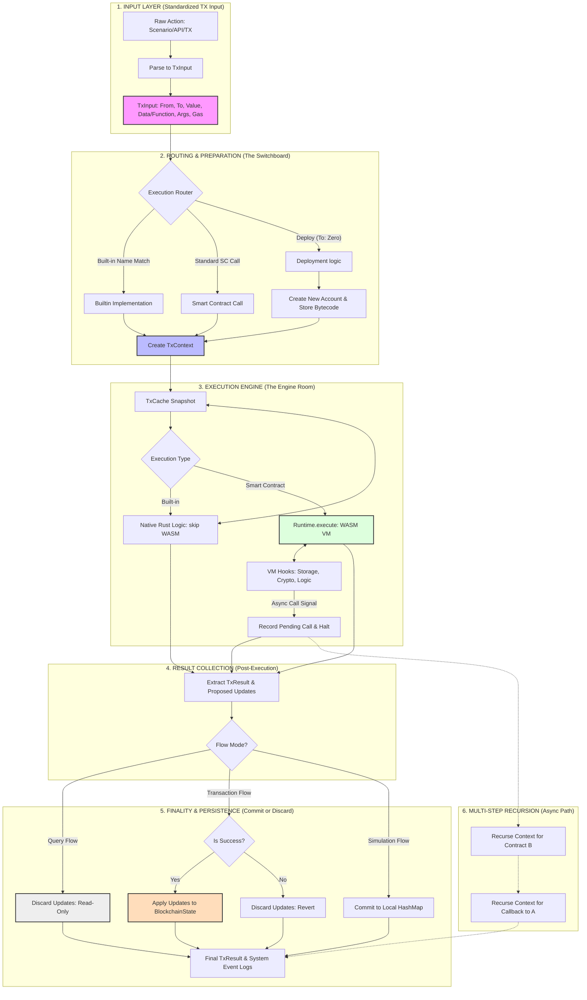

# Rust SDK

### What is 

```plaintext
chain/
```

?

The 

```plaintext
chain/
```

 directory contains the **core blockchain infrastructure** for MultiversX smart contracts. It has two main parts:

1. **`chain/core/`**
    
     - Basic blockchain types and constants
    
    - Defines fundamental data structures like 
        
        ```plaintext
        Address
        ```
        
         (32 bytes)
        
    - Contains blockchain specifications (code metadata, token types, ESDT roles)
        
    - Shared between smart contracts and VM implementations
        
2. **`chain/vm/`**
    
     - A Rust implementation of the MultiversX Virtual Machine
    
    - Used for **testing and debugging** smart contracts locally
        
    - Simulates how contracts run on the real blockchain
        
    - Not the actual production VM, but a development tool
        

### What is 

```plaintext
chain/vm/
```

?

Think of 

```plaintext
chain/vm/
```

 as a **blockchain simulator** that runs on your computer. When you write a smart contract, you need to test it before deploying to the real blockchain. This VM lets you:

- Execute your contract code locally
    
- Debug issues without spending real tokens
    
- Run tests in a controlled environment
    
- Simulate blockchain state (accounts, balances, storage)
    

**Key components:**

- ```plaintext
    blockchain/
    ```
    
     - Simulates blockchain state (accounts, balances)
    
- ```plaintext
    host/
    ```
    
     - Manages contract execution environment
    
- ```plaintext
    executor_impl/
    ```
    
     - Executes the actual contract code
    
- ```plaintext
    builtin_functions/
    ```
    
     - Implements blockchain built-in operations
    
- ```plaintext
    crypto_functions/
    ```
    
     - Cryptographic operations (hashing, signatures)
    

### What are VM Hooks?

**VM Hooks** are the **bridge between your smart contract and the blockchain**.

Think of them as an API that your contract uses to interact with the blockchain:

**When your contract needs to:**

- Get the caller's address → calls 
    
    ```plaintext
    get_caller()
    ```
    
     hook
    
- Read from storage → calls 
    
    ```plaintext
    storage_load()
    ```
    
     hook
    
- Send tokens → calls 
    
    ```plaintext
    transfer_value()
    ```
    
     hook
    
- Get block timestamp → calls 
    
    ```plaintext
    get_block_timestamp()
    ```
    
     hook
    
- Write logs → calls 
    
    ```plaintext
    write_event_log()
    ```
    
     hook
    

**How it works:**

1. Your contract code (compiled to WebAssembly) runs in isolation
    
2. When it needs blockchain data, it calls a VM Hook function
    
3. The VM Hook handler (
    
    ```plaintext
    VMHooksHandler
    ```
    
    ) processes the request
    
4. The dispatcher (
    
    ```plaintext
    VMHooksDispatcher
    ```
    
    ) routes it to the right implementation
    
5. The result is returned to your contract
    

**Example hooks:**

- ```plaintext
    get_sc_address()
    ```
    
     - Get current contract address
    
- ```plaintext
    get_owner_address()
    ```
    
     - Get contract owner
    
- ```plaintext
    storage_store()
    ```
    
     / 
    
    ```plaintext
    storage_load()
    ```
    
     - Read/write storage
    
- ```plaintext
    managed_caller()
    ```
    
     - Get who called the contract
    
- ```plaintext
    big_int_add()
    ```
    
     - Perform big integer math
    
- ```plaintext
    managed_async_call()
    ```
    
     - Call another contract
mx-sdk-rs has 6 core execution flows
```
1. General Transaction Execution Flow (SC execution)
2. Built-in Function Execution Flow (protocol operations)
3. Smart Contract Deployment Flow
4. Smart Contract Query (Read-only VM) Flow
5. Simulation / Scenario Execution Flow
6. Async Call / Callback Execution Flow
```
mx-sdk-rs (Rust): Produces the WASM "Blueprints."
mxpy / mx-sdk-js (Python/JS): Acts as the "Courier" to send those blueprints to the network in a transaction.
mx-chain-go (Go): Acts as the "Storage" and "Traffic Controller" on Mainnet.
mx-chain-vm-go (Go/WASM): Acts as the "Real Engine" that actually executes the WASM logic on Mainnet.

## 1. GENERAL TRANSACTION EXECUTION FLOW

The **General Transaction Execution Flow** is the **State Transition Function** of the blockchain.
It is the **only path** through which the blockchain's official record (who owns what) can be mutated. Every other feature in the SDK—from wallets to explorers—is simply a variation or a tool built to support this one, core flow.
### The Heart of the Blockchain
In a blockchain, nothing happens by accident. Every time you send tokens, buy an NFT, or interact with an app, you are triggering a **Transaction**. But a transaction isn't just a message; it is a request for the blockchain to change its "state" (its official record of who owns what).

This guide explains the **General Transaction Execution Flow**—the precise sequence of events that turns your request into a permanent part of history.

1. **perform_sc_call_lambda()**     `framework/scenario/src/scenario/run_vm/sc_call.rs:25` 
    └─ **tx_input_from_call()** [CONSTRUCT TX INPUT]   `sc_call.rs:61` 
    ↓
2. **commit_call_with_async_and_callback()**   `chain/vm/src/host/execution/exec_call.rs:53`  ↓
3. **commit_call()**   `chain/vm/src/host/execution/exec_call.rs:25` 
	├─ **state.subtract_tx_gas()** [PRE-PAY GAS] `exec_call.rs:34` 
	 │
	└─ **execute_builtin_function_or_default()** (ROUTER) `chain/vm/src/host/execution/exec_general_tx.rs:15` 
	↓
4. **execute_default()** `chain/vm/src/host/execution/exec_general_tx.rs:103`
	├─ **tx_cache.transfer_egld_balance()** [VALUE TRANSFER] `exec_general_tx.rs:113` 
	 │
	├─ **TxContext::new()** [WORKSPACE PREP]  `exec_general_tx.rs:141` 
	 │
	└─ **runtime.execute()** `chain/vm/src/host/runtime.rs:107` 
	↓
5. **Runtime::execute() [WASM Handover]**  `runtime.rs:107` 
	├─ **self.set_executor_context()** [HOT-SWAP CONTEXT] `runtime.rs:117` 
	 │
	├─ **self.executor.new_instance()** [LOAD WASM] `runtime.rs:128` 
	 │
	└─ **call_lambda.call()** [CONTRACT LOGIC RUNS] 
    `runtime.rs:133` └─ **VM Hooks Interface** (Storage, Math, Crypto) 

    `chain/vm/src/host/vm_hooks/vh_context.rs:15` ↓
6. **tx_context.into_results()** 

    `tx_context.rs:184` [EXTRACT (TxResult, BlockchainUpdate)] ↓
7. **blockchain_updates.apply(state)** 

    `exec_call.rs:41` [WRITE TO STORAGE - BLOCKCHAIN STATE UPDATED] ↓
8. **Return TxResult** 

    `exec_call.rs:47`
    
### Step 1: The Request (**Transaction Input**)

**Purpose:** Defining what you want to do.

Think of this as filling out a digital form. You aren't just saying "do something," you are providing specifics: who is sending the request, which contract you want to talk to, how much money you're attaching, and which specific "function" (recipe) you want to run.

- **Behind the scenes:** The SDK gathers your intent into a structured object called `TxInput`. You can find this definition in `chain/vm/src/host/context/tx_input.rs`.
- **The Code:**
```rust
// A simplified look at what the SDK prepares
pub struct TxInput {
    pub from: Address,
    pub to: Address,
    pub egld_value: BigUint,
    pub func_name: TxFunctionName,
    pub args: Vec<Vec<u8>>,
}
```

### Step 2: The Post Office (**Execution Router**)

**Purpose:** Directing your request to the right department.

Once your "form" (`TxInput`) is ready, it enters the **Execution Router**. The router's job is to look at the destination address and decide who should handle it. Is this a common, simple task that the blockchain already knows how to do (like a simple transfer)? Or is it a custom program written by a developer?

- **Behind the scenes:** It uses a "router" file to branch the logic.
- **The Function:** `execute_builtin_function_or_default` in `chain/vm/src/host/execution/exec_general_tx.rs:15`.

---

### Step 3: The Big Decision (**Builtin OR Contract?**)

**Purpose:** Choosing the right tool for the job.

If you are performing a standard action (like moving an ESDT token), the blockchain uses a "Builtin" function—a pre-optimized shortcut. If you are calling a custom Smart Contract, it needs to prepare a "Virtual Machine" to run that specific code.

- **Behind the scenes:** The router checks if the function name matches a known "Builtin" shortcut.
- **The Code:**
```rust
// exec_general_tx.rs:27
runtime.vm_ref.builtin_functions.execute_builtin_function_or_else(...)
```

### Step 4: Setting the Stage (**Create TxContext**)

**Purpose:** Gathering all the tools and workspace needed.

Before a program can run, it needs a workspace. We create a `TxContext`. This is like a "sandbox" that contains:

1. **TxCache:** A temporary copy of the blockchain accounts so the program can "check" balances without slowing down the real network.
2. **Managed Types:** Special high-speed memory for the program to use.
3. **Result Collector:** A blank notebook where the program will write down everything that happened.

- **The Function:** `TxContext::new(runtime, tx_input, tx_cache)` in `exec_general_tx.rs:141`.

---

### Step 5: Starting the Motor (**Runtime.execute**)

**Purpose:** Handing the request to the Virtual Machine (VM).

Now the "Engine" starts. The `runtime.execute` function hands the `TxContext` and the actual contract code (WASM) to the Virtual Machine. The VM is a safe, isolated environment where the code can run without being able to crash the rest of the blockchain.

- **The Code:**
```rust
// exec_general_tx.rs:143
let tx_context = runtime.execute(tx_context, f);
```

### Step 6: The Connection Windows (**VM Hooks**)

**Purpose:** Letting the program "talk" to the blockchain.

A smart contract is like a prisoner in a room—it can't see the outside world. **VM Hooks** are special "windows" in that room. If the contract needs to know how much money a user has, it calls a Hook. If it wants to save data, it calls a Hook.

- **Behind the scenes:** These hooks (storage, crypto, math) are defined in `chain/vm/src/host/vm_hooks/vh_context.rs`.
- **Plain English:** The contract says, "Hook, tell me the current block number," and the hook provides the answer safely.

---

### Step 7: The Logic Runs (**Contract Execution**)

**Purpose:** Running the actual instructions.

This is where the actual "math" happens. The contract code executes its logic: "If User A has 10 tokens, give them an NFT and subtract 10 tokens." It doesn't change the real blockchain yet; it just calculates what _should_ happen.

---
### Step 8: The Receipt (**TxResult**)

**Purpose:** Summarizing the outcome.

When the program finishes, it produces a `TxResult`. This is the final report. It says: "Success! I generated 2 logs, returned the value '5', and used this much gas."

- **The Code:**
```rust
// exec_general_tx.rs:145
tx_context.into_results()
```
---
### Step 9: Writing into Stone (**BlockchainUpdate**)

**Purpose:** Making the changes permanent.

Up until this final second, nothing has actually changed on the official record. The `BlockchainUpdate` contains all the _proposed_ changes. In the final step, the system takes those changes and "applies" them to the real blockchain state.

- **The Function:** `blockchain_updates.apply(state)` in `exec_call.rs:41`.

## 2. BUILT-IN FUNCTION EXECUTION FLOW
**No WASM execution happens here.**

Built-in functions are **Protocol Logic**, not **Contract Logic**. They represent the hardcoded rules of the blockchain that exist for performance and security. This is the "Express Lane" that powers 90% of simple asset transfers on the network.

In our journey through the blockchain SDK, we previously saw how Smart Contracts run like custom apps on a computer. But some tasks are so essential—like moving money or changing an owner—that the blockchain team built them directly into the "operating system" itself. These are **Built-in Functions**.

Think of them as the **Express Lane** of the blockchain: they skip the heavy "Virtual Machine" and run at the speed of the protocol.

Viewed tx_cache.rs:1-141
Ran command: `grep -r "fn transfer_esdt_balance" .`
Viewed tx_cache_balance_util.rs:1-128

### Built-in Function Execution Call Stack (ESDTTransfer)

**ESDTTransfer Call Stack**

**perform_sc_call_lambda()**
`framework/scenario/src/scenario/run_vm/sc_call.rs:25`
↓

**execute_builtin_function_or_default()** (Router)
`chain/vm/src/host/execution/exec_general_tx.rs:15`
↓

**BuiltinFunctionCall::execute_or_else()** (Detector)
`chain/vm/src/builtin_functions/builtin_func_container.rs:85`
↓

**ESDTTransfer::execute()** (Built‑in Function)
`chain/vm/src/builtin_functions/transfer/esdt_transfer_mock.rs:32`
├─ **try_parse_input()**
│  `esdt_transfer_mock.rs:77`
├─ **build_log()** [GATHER DATA FOR RECEIPT]
│  `esdt_transfer_mock.rs:55`
└─ **execute_transfer_builtin_func()**
   `chain/vm/src/builtin_functions/transfer/transfer_common.rs:60`
↓

**TxCache::transfer_esdt_balance()** (Protocol Logic)
`chain/vm/src/host/context/tx_cache_balance_util.rs:105`
↓

**Detailed Sub‑Step: SENDER Balance Update**
`tx_cache_balance_util.rs:43`
├─ **with_account_mut()** [LOAD SENDER FROM STORAGE]
│  `tx_cache.rs:76`
├─ **Validation Function** (Check Insufficient Funds)
│  `tx_cache_balance_util.rs:62`
├─ **Computation (Subtract)**
│  [Subtracts transfer value from sender's ESDT instance balance]
└─ **Storage Write** (Cache updated)
   `tx_cache_balance_util.rs:66`
↓

**Detailed Sub‑Step: RECEIVER Balance Update**
`tx_cache_balance_util.rs:72`
├─ **with_account_mut()** [LOAD RECEIVER FROM STORAGE]
│  `tx_cache.rs:76`
├─ **Computation (Add)**
│  [Adds transfer value to receiver's ESDT instance balance]
└─ **Storage Write** (Cache updated)
   `tx_cache_balance_util.rs:81`
↓

**Return TxResult with logs**
`transfer_common.rs:90`

---

### Step 1: The Request (**Transaction Input**)

**Purpose:** Handing your ticket to the system.

Just like any other action, we start with a `TxInput`. This object holds your intent, but instead of calling a complex custom function, you use a "magic word" that the protocol recognizes, like `ESDTTransfer` or `ChangeOwner`.

- **The Code:** `TxInput` in `chain/vm/src/host/context/tx_input.rs`.

---

### Step 2: The Router (**exec_general_tx**)

**Purpose:** Deciding between the "Express Lane" or the "Local Lane."

The request hits the router (`execute_builtin_function_or_default`). Its primary job is to look at your request and ask: "Is this one of our native shortcuts?"

- **The Function:** `execute_builtin_function_or_default` in `chain/vm/src/host/execution/exec_general_tx.rs:15`.

---

### Step 3: The Detector (**Check: Builtin OR Contract?**)

**Purpose:** Identifying the shortcut.

The system looks up your function name in a Catalog. If it sees a name it knows (like `ChangeOwner`), it diverts the request away from the Smart Contract engine.

- **Behind the scenes:** The "Detector" uses a simple `match` statement to compare your function name against a list of protocol-defined constants.
- **The Code:**
```rust
// builtin_func_container.rs:119
CHANGE_OWNER_BUILTIN_FUNC_NAME => self.execute_bf(ChangeOwner, f),
```

### Step 4: The Workspace (**Create TxContext**)

**Purpose:** Preparing the playground, even for shortcuts.

Even though we are skipping the complex stuff, we still need a `TxContext`. This holds the `TxCache` (the mirror of the blockchain) so we can modify it safely.

- **The Function:** `TxContext::new(...)` in `exec_general_tx.rs:141`.

---

### Step 5: Skipping the Engine (**Bypassing Runtime.execute**)

**Purpose:** Efficiency by omission.

Here is where the Built-in flow differs drastically from Smart Contracts. **Neither `runtime.execute()` nor the WASM Virtual Machine are ever started.**

Instead of loading a "box" (Virtual Machine) to run your code, the system just runs a plain Rust function. This is why it's so much faster and cheaper.

- **Plain English:** While a Smart Contract has to "start a computer" to run its math, a Built-in function just "does the math" immediately.

---

### Step 6: Native Logic (**Replacing Contract Execution**)

**Purpose:** Executing the protocol's own rules.

The "logic" here isn't written in a contract; it is written in the SDK itself. For example, the `ChangeOwner` builtin simply updates a field in the account data.

- **The Code:**
```rust
// change_owner_mock.rs:35
tx_cache.with_account_mut(&tx_input.to, |account| {
    account.contract_owner = Some(new_owner_address);
});
```
### Step 7: The Receipt (**TxResult**)

**Purpose:** Summarizing the success.

Once the native logic finishes, it creates a `TxResult`. It looks the same as a Smart Contract result, so the rest of the blockchain doesn't have to worry about how it was made.

- **The Code:** `tx_context.into_results()` in `exec_general_tx.rs:145`.

---

### Step 8: The Final Seal (**BlockchainUpdate**)

**Purpose:** Making the changes "Law."

Finally, the updates made to the cache are committed. Whether it was a complex contract or a fast Built-in, the changes are applied to the real blockchain state the same way.

- **The Function:** `blockchain_updates.apply(state)` in `exec_call.rs:41`.

## 3. SMART CONTRACT DEPLOYMENT FLOW
In the world of blockchain, a Smart Contract starts its life as a file on a developer's computer. But to make it "live" on the network, it must go through a process called **Deployment**. This isn't just uploading a file; it is the act of creating a new digital identity and running its "setup" instructions for the very first time.

**Deployment = execution + storage initialization.**

You aren't just saving code to the blockchain; you are running that code once to "seed" the contract's initial state. A contract cannot exist on the blockchain without being "born" through this initialization flow.

**Smart Contract Deployment Flow**

**perform_sc_deploy_update_results()** 

`framework/scenario/src/scenario/run_vm/sc_deploy.rs:20` ↓

**perform_sc_deploy_lambda()** 

`sc_deploy.rs:31` ├─ **tx_input_from_deploy()** [PREPARE DEPLOY INPUT] │ 

`sc_deploy.rs:58` └─ **execution::commit_deploy()** 

`chain/vm/src/host/execution/exec_create.rs:9` ↓

**execute_deploy()** (Deployment Controller) 

`exec_create.rs:47` ├─ **tx_cache.get_new_address()** [DETERMINISTIC ADDRESS CALC] │ 

`chain/vm/src/host/context/tx_cache.rs:102` ├─ **TxContext::new()** [CONTEXT PREP] │ 

`exec_create.rs:60` └─ **create_new_contract()** (Sub‑Step: Account Creation) 

`chain/vm/src/host/context/tx_context.rs:153` ├─ **Validation Function** (Check Address Collision) │ 

`tx_context.rs:160` └─ **tx_cache.insert_account()** [STORE CODE & METADATA] 

`tx_context.rs:165` [Writes bytecode path to the new contract's AccountData] ↓

**runtime.execute()** (Runtime Controller) 

`chain/vm/src/host/runtime.rs:107` ├─ **self.executor.new_instance()** [WASM INSTANTIATION] │ 

`runtime.rs:128` └─ **call_lambda.call()** [RUN INIT FUNCTION] 

`runtime.rs:133` [Execution of the constructor to set initial storage values] ↓

**tx_context.into_results()** 

`tx_context.rs:184` ↓

**BlockchainUpdate::apply()** [COMMIT TO MAIN STATE] 

`exec_create.rs:37` [The new account and its initialized storage are persisted] ↓

**Return New Address & TxResult** 

`exec_create.rs:43`

---
### Step 1: The Blueprint (**Deployment Input**)

**Purpose:** Packaging the code and instructions.

Instead of sending a message to a person, you send a transaction that contains the **WASM bytecode** (the binary blueprint of your contract) and any "starting settings" (arguments) it needs.

- **Behind the scenes:** The SDK creates a `TxInput` where the "To" address is effectively blank (zero), signaling that this transaction is a request to create something new.
- **The Code:** `tx_input_from_deploy` in `framework/scenario/src/scenario/run_vm/sc_deploy.rs:58`.

---

### Step 2: The Router (**exec_create**)

**Purpose:** Handing the request to the "Creation Office."

The system identifies that this is a deployment request. Instead of the standard router, it goes to a specialized logic for building new accounts.

- **The Function:** `commit_deploy` in `chain/vm/src/host/execution/exec_create.rs:9`.

---

### Step 3: Determining the Home (**Check: Builtin OR Contract?**)

**Purpose:** Finding the new contract's address.

The blockchain uses your address and a counter (your "nonce") to mathematically calculate a unique address for the new contract. It's like the blockchain assigning a house number before the building even exists.

- **The Function:** `tx_cache.get_new_address(&tx_input.from)` in `exec_create.rs:58`.

---

### Step 4: The Workspace (**Create TxContext**)

**Purpose:** Preparing the environment for initialization.

Just like a regular call, we need a `TxContext`. However, this context is special: it’s the first time this specific address has ever been used in the system.

- **The Function:** `TxContext::new(...)` in `exec_create.rs:60`.

---

### Step 5: Building the Vault (**Create New Account**)

**Purpose:** Setting up the digital identity.

The system officially creates a new account in the `TxCache`. It establishes a place for the contract's money, its storage (data), and its code.

- **Behind the scenes:** At this split second, the account is created, and the WASM bytecode (the "blueprint") is saved into the account's record.
- **The Code:**
```rust
// tx_context.rs:172
contract_path: Some(contract_path),
```

### Step 6: The Grand Opening (**Runtime.execute**)

**Purpose:** Running the setup manual (`init`).

Every contract has an `init()` function (the "Constructor"). Now that the account exists, the Virtual Machine runs this function exactly once. It sets up the very first pieces of data—like who the "Owner" is or the starting price of a token.

- **The Function:** `runtime.execute(tx_context, f)` in `exec_create.rs:83`.

---

### Step 7: Connecting to State (**VM Hooks**)

**Purpose:** Letting the "Setup" code write data.

During the `init()` execution, the code uses **Hooks** to write the initial state to the blockchain. For example, it might save "Owner = Alice" into the contract's permanent storage.

---

### Step 8: Final Review (**TxResult**)

**Purpose:** Checking if the "birth" was successful.

If the `init()` function crashes or fails, the whole deployment is cancelled, and the account is never created. If it succeeds, we get a `TxResult` confirming the contract is ready for business.

- **The Code:** `tx_context.into_results()` in `exec_create.rs:85`.

---

### Step 9: The Final Seal (**BlockchainUpdate**)

**Purpose:** Making the new contract "Law."

The final step merges the new account, its saved code, and the data created during `init()` into the official blockchain record.

- **The Function:** `blockchain_updates.apply(state)` in `exec_create.rs:37`.

## 4. SMART CONTRACT QUERY FLOW
**Same execution engine, but no commit.**

This flow ensures that you get a mathematically perfect answer without ever risking a change to the blockchain's official record. It is the only way to "look" at the blockchain without actually "touching" it.

Imagine a blockchain as a locked library. A **Transaction** is like going to the desk and asking the librarian to rewrite a page in a book. A **Query**, on the other hand, is simply walking in and reading a book. You get the information you need, but the library stays exactly as it was when you left.

Here is how the blockchain handles a "Read-Only" request.
### Smart Contract Query Call Stack (Rust VM)

**Smart Contract Query Flow**

**perform_sc_query_update_results()**
`framework/scenario/src/scenario/run_vm/sc_query.rs:18`
↓

**perform_sc_query_in_debugger()**
`sc_query.rs:27`
├─ **tx_input_from_query()** [SIMULATE INPUT]
│  `sc_query.rs:44`
│  [Sets gas to MAX and value to 0 for read‑only access]
└─ **execution::execute_query()**
   `chain/vm/src/host/execution/exec_query.rs:10`
↓

**execute_query()** (Query Controller)
`exec_query.rs:10`
├─ **TxCache::new()** [READ ONLY SNAPSHOT]
│  `exec_query.rs:19`
├─ **TxContext::new()** [WORKSPACE PREP]
│  `exec_query.rs:20`
└─ **runtime.execute()**
   `chain/vm/src/host/runtime.rs:107`
↓

**Runtime::execute()** (Execution Engine)
`runtime.rs:107`
├─ **executor.new_instance()** [WASM INSTANTIATION]
│  `runtime.rs:128`
└─ **call_lambda.call()** [RUN CONTRACT VIEW FUNCTION]
   `runtime.rs:133`
   ├─ **VM Hooks (Read)** [FETCH DATA FROM CACHE]
   │  `vh_context.rs:76`
   └─ **Contract Returns Value**
↓

**tx_context.into_results()**
`chain/vm/src/host/context/tx_context.rs:184`
├─ **let (tx_result, _)** [DISCARD PROPOSED CHANGES]
│  `exec_query.rs:22`
│  [The underscore ensures that blockchain_updates are never applied]
└─ **Return TxResult**
   `exec_query.rs:23`  
   │ [Contains only the data returned by the contract, no state changes]
---
### Step 1: The Request (**Query Input**)

**Purpose:** Asking a question without paying a fee.

Unlike a transaction, a query doesn't need to be signed by your private key, and it doesn't cost any money. You simply say: "I want to know how many tokens Alice has" or "What is the current price of this item?"

- **Behind the scenes:** The SDK creates a "fake" transaction input. It gives you infinite gas (`u64::MAX`) and sets the cost to zero, so the "reading" can happen without any barriers.
- **The Code:** `tx_input_from_query` in `framework/scenario/src/scenario/run_vm/sc_query.rs:44`.

---

### Step 2: The Simulation Router (**execute_query**)

**Purpose:** Setting up the "What If" scenario.

The request enters the system. Instead of the "Real Transaction" path, it goes through a specialized logic for queries. This path is designed to be a simulation—a "What If" scenario that never becomes "Law."

- **The Function:** `execution::execute_query` in `chain/vm/src/host/execution/exec_query.rs:10`.

---

### Step 3: The Sandbox (**Create TxContext**)

**Purpose:** Creating a temporary workspace.

We still create a `TxContext`. This is like giving the contract a temporary notebook to do its math. The contract can even _pretend_ to write data to storage while looking for your answer, but it is only writing to a temporary "scratchpad" (the Cache).

- **The Function:** `TxContext::new(...)` in `exec_query.rs:20`.

---
### Step 4: The Engine (**Runtime.execute**)

**Purpose:** Starting the exact same motor.

**This is the magic part:** The blockchain uses the _identical_ Virtual Machine engine for queries as it does for real money transactions. This ensures that the answer you get from a query is 100% mathematically accurate and perfectly matches what would happen in a real transaction.

- **The Code:**
```rust
// exec_query.rs:21
let tx_context = runtime.execute(tx_context, f);
```
---
### Step 5: The Read Hooks (**VM Hooks**)

**Purpose:** Looking into the official records.

The contract uses **Hooks** to "look" into the blockchain's official record. It pulls out the specific data you asked for, like a balance or a piece of text.

---
### Step 6: The Answer (**TxResult**)

**Purpose:** Extracting the data for the user.

Once the contract finishes its calculation, it produces a `TxResult`. This contains the "Return Values"—the specific answer to the question you asked at the beginning.

- **The Code:**
```rust
// exec_query.rs:22
let (tx_result, _) = tx_context.into_results();
```
---
### Step 7: The Discard (**No State Update**)

**Purpose:** Keeping the blockchain unchanged.

In a real transaction, we take the "notebook" of changes and merge it into the official records. **In a query, we shred the notebook.** The `_` in the code below represents the changes being completely ignored. Nothing is ever saved to the blockchain.

- **The logic:**
```rust
// The underscore (_) means "discard these changes"
let (tx_result, _) = tx_context.into_results();
return tx_result;
```
---
## 5. SIMULATION / SCENARIO FLOW
**This is a LOCAL blockchain replica.**

This flow isn't just for "testing"—it is an **Execution Model Simulation**. It allows developers to see exactly how their code will behave in the real world, with 100% accuracy, without ever needing an internet connection or real money.

Testing a Smart Contract on a real blockchain can be slow and expensive. To solve this, the SDK creates a **Simulation Universe**. This is a 100% accurate, private replica of the MultiversX blockchain that lives entirely inside your computer’s memory. It’s a "Sandbox" where you can play God—creating accounts and running complex transactions in milliseconds.

### Simulation / Scenario Call Stack (Rust VM)

**Simulation / Scenario Flow**

**ScenarioWorld::run()** (Facade Entry)
`framework/scenario/src/facade/scenario_world.rs:83`
↓

**DebuggerBackend::run_scenario_file()**
[`framework/scenario/src/facade/debugger_backend.rs:30`]
↓

**ScenarioVMRunner::run_step()** (Step Dispatcher)
[`framework/scenario/src/scenario/run_vm/mod.rs:100`]
[Parses whether the step is a SetState, CheckState, or Transaction]
↓

**ScenarioVMRunner::perform_sc_call_update_results()**
`framework/scenario/src/scenario/run_vm/sc_call.rs:18`
↓

**execution::commit_call_with_async_and_callback()** (Controller)
`chain/vm/src/host/execution/exec_call.rs:53`
↓

**Detailed Sub‑Step: The "Snap‑Shot" Execution**
`chain/vm/src/host/execution/exec_call.rs:36`
├─ **TxCache::new()** [CREATE SCRATCHPAD]
│  `tx_cache.rs:32`
├─ **execute_builtin_function_or_default()**
│  [Logic runs as audited, modifying ONLY the cache]
└─ **TxResult Extraction**
   `exec_call.rs:37`
↓

**The "Commit‑or‑Rollback" Decision**
`exec_call.rs:40`
├─ **Validation Function** (Check Success Status)
│  `exec_call.rs:40`
├─ **Computation (Commit)**
│  [If success, prepare to merge cache changes into global HashMap]
└─ **blockchain_updates.apply(state)** [THE FINAL MUTATION]
   `exec_call.rs:41`
   └─ **BlockchainState::commit_updates()**
      `chain/vm/src/blockchain/state/blockchain_state.rs:43`
      [Native HashMap merge: state.accounts.extend(updates.accounts)]
↓

**Return Scenarioto Result/Trace**
`sc_call.rs:22`
[Saves the final response back to the Scenario JSON model]

---

### Step 1: The Presence (**ScenarioWorld**)

**Purpose:** Becoming the "God" of your universe.

You start by creating a `ScenarioWorld`. This is your master control center. In this mode, you can create accounts out of thin air, give yourself a billion tokens, and freeze time.

- **The Code:** `ScenarioWorld::new()` in `framework/scenario/src/facade/scenario_world.rs:49`.

---

### Step 2: The Spreadsheet (**BlockchainMock**)

**Purpose:** Storing the world state in a simple map.

In a real blockchain, data is spread across thousands of hard drives. In the simulator, the entire "State" is stored in a `BlockchainMock`. Think of this as a simple spreadsheet (a `HashMap`) that tracks every address and its current balance.

- **The Code:** `BlockchainState` in `chain/vm/src/blockchain/state/blockchain_state.rs:19`.

---

### Step 3: The Command (**Transaction Input**)

**Purpose:** Sending an order to the simulation.

You tell the simulation to perform an action (like calling a contract). The SDK packages this into a `TxInput`, just like it would for a real network.

---

### Step 4: The Path (**exec_general_tx**)

**Purpose:** Following the standard rules.

Even though this is a simulation, it follows the **exact same rules** as a real blockchain. The request enters the router (`exec_general_tx`) to see if it should take a shortcut (Built-in) or run the full contract logic.

- **The Function:** `execute_builtin_function_or_default` in `exec_general_tx.rs:15`.

---

### Step 5: The Scratchpad (**Create TxContext**)

**Purpose:** Creating a "Save Point."

Before the simulation changes the "official" spreadsheet, it creates a scratchpad (`TxCache`). Every change the contract makes is written here first. This is how we can "Rollback" if the execution fails.

- **The Function:** `TxContext::new(...)` in `exec_general_tx.rs:141`.

---

### Step 6: The Heartbeat (**Runtime.execute**)

**Purpose:** Running the real blockchain engine.

**This is the key:** The simulation uses the _actual_ execution engine that lives on real nodes. It’s not a "fake" or "simplified" version; it is the real contract runner connected to your local spreadsheet instead of a global network.

- **The Code:** `runtime.execute(tx_context, f)` in `exec_general_tx.rs:143`.

---

### Step 7: Reading the Map (**VM Hooks**)

**Purpose:** Looking up data in your private records.

The contract uses **Hooks** to look up data. Because this is a simulation, the Hooks don't look across the internet; they look directly into your `BlockchainMock` spreadsheet.

---

### Step 8: The Conclusion (**TxResult**)

**Purpose:** Reporting the success or failure.

The contract finishes and provides a `TxResult`. It tells you exactly what happened, what logs were made, and how much "simulated gas" was used.

---

### Step 9: Commit or Rollback (**BlockchainUpdate**)

**Purpose:** Deciding if the changes become "Real."

This is the final fork in the road for a simulation:

- **Success:** If the transaction worked, the changes from the "scratchpad" are merged into your "official spreadsheet."
    
- **Failure:** If it failed, the scratchpad is shredded. It’s as if the transaction never happened—no money was lost, and no records were changed.
    
- **The logic:**
```rust
// exec_call.rs:40
if tx_result.result_status.is_success() {
    blockchain_updates.apply(state);
}
```
---
## 6. ASYNC CALL / CALLBACK FLOW
**Execution is NOT always linear.**

It can branch out to other contracts and return with answers. This allows complex applications to work together as a team across the entire blockchain, rather than being limited to just one program at a time.

Most blockchain actions are like a single straight road. But sometimes, a contract needs help from another contract. It needs to "delegate" a task and wait for the answer before it can finish. This is the **Async Call / Callback Flow**. It’s like sending an assistant to the store while you wait at home to start cooking—you can't finish the meal until they return with the groceries.

### Async Call / Callback Call Stack (Rust VM)

**Async Call / Callback Flow**

**commit_call_with_async_and_callback()** (Orchestrator)
`chain/vm/src/host/execution/exec_call.rs:53`
↓

**Detailed Sub‑Step: Phase 1 — Original Call (Contract A)**
`exec_call.rs:63`
├─ **perform_async_call()** [VM HOOK TRIGGERED]
│  `vh_tx_context.rs:136`
├─ **Validation Function** (Save Pending Call Data)
│  `vh_tx_context.rs:147`
└─ **early_exit_async_call()** [HALT EXECUTION OF A]
   `vh_tx_context.rs:148`
   [Contract A stops immediately; control returns to host]
↓

**commit_async_call_and_callback()** (Recursive Phase)
`exec_call.rs:96`
↓

**Detailed Sub‑Step: Phase 2 — Async Execution (Contract B)**
`exec_call.rs:104`
├─ **async_call_tx_input()** [PREPARE INPUT FOR B]
│  `exec_call.rs:102`
└─ **commit_call()** [EXECUTE B]
   [Contract B runs its logic and produces result]
↓

**Detailed Sub‑Step: Phase 3 — Callback (Back to Contract A)**
`exec_call.rs:116`
├─ **async_callback_tx_input()** [PREPARE CALLBACK INPUT]
│  `exec_call.rs:111`
│  [Includes success/failure status and data from Contract B]
└─ **commit_call()** [RUN CALLBACK LOGIC]
   [Contract A resumes at its callback endpoint to finalize task]
↓

**Final Consolidator: Result Merging**
`exec_call.rs:75`
├─ **merge_async_results()** [COMBINE ALL STEPS]
│  `exec_call.rs:75`
│  [Merges logs/results from A, B, and the Callback into one report]
└─ **BlockchainUpdate::apply()** [COMMIT ALL CHANGES]
   `exec_call.rs:41`
↓

**Return Final TxResult**
`exec_call.rs:78`

---
### Step 1: The First Act (**Contract A executes**)

**Purpose:** Starting the original mission.

Contract A starts its work just like any other contract. It follows its instructions until it hits a line of code that requires another contract's help.

- **The Code:** `commit_call(tx_input, ...)` in `chain/vm/src/host/execution/exec_call.rs:63`.

---

### Step 2: Requesting Help (**Makes async call -> Contract B**)

**Purpose:** Asking a neighbor for assistance.

Contract A reaches the point where it needs Contract B. It uses a special command called an `async_call`.

- **The Function:** `perform_async_call` in `chain/vm/src/host/vm_hooks/vh_tx_context.rs:136`.
---
### Step 3: The Interruption (**Pending call recorded**)

**Purpose:** Pausing the first mission safely.

**This is the unique part:** Contract A doesn't "stay awake" while waiting. Instead, it stops entirely. The system writes down exactly what Contract A needs from Contract B and saves it as a "Pending Call."

- **Behind the scenes:** The system throws an "Early Exit" error, which tells the engine: "Stop Contract A right now, we have a pending task."
- **The Code:**
```rust
// vh_tx_context.rs:147
tx_result.pending_calls.async_call = Some(async_call_data);
```
### Step 4: The Second Act (**Contract B executes**)

**Purpose:** Running the helper's code.

Now the blockchain temporarily forgets about Contract A and starts a _brand new_ execution for Contract B. Contract B runs its logic, does its math, and produces its own result.

- **The Function:** `commit_async_call_and_callback` in `exec_call.rs:96`.

---

### Step 5: The Messenger (**Callback scheduled**)

**Purpose:** Preparing the answer for Contract A.

Once Contract B is finished, the system takes its result and creates a new "Callback" request. It’s like the assistant returning from the store and heading back to your house.

- **The Function:** `async_callback_tx_input` in `exec_call.rs:111`.
---
### Step 6: The Reunion (**Return to Contract A**)

**Purpose:** Giving the answer to the original contract.

Contract A is "woken up" specifically at its **Callback** function. It receives the results from Contract B (success or failure) and uses that information to finish its original mission.

- **The Code:**
```rust
// exec_call.rs:116
let callback_result = commit_call(callback_input, ...);
```
---
### Step 7: The Master Report (**Final TxResult**)

**Purpose:** Consolidating the whole story.

Because this was a multi-step journey, the system merges all the logs and results from Contract A, Contract B, and the Callback into one single master report.

- **The Logic:**
```rust
// exec_call.rs:75
tx_result = merge_async_results(tx_result, async_result);
```
---
### Step 8: Applying the Changes (**BlockchainUpdate**)

**Purpose:** Making the entire team's work permanent.

Finally, the changes from all steps are applied. If any part of the critical chain failed, the system can ensure that no state is changed, keeping the blockchain consistent.

- **The Logic:** `blockchain_updates.apply(state)` in `exec_call.rs:41`.

# Final Flow
